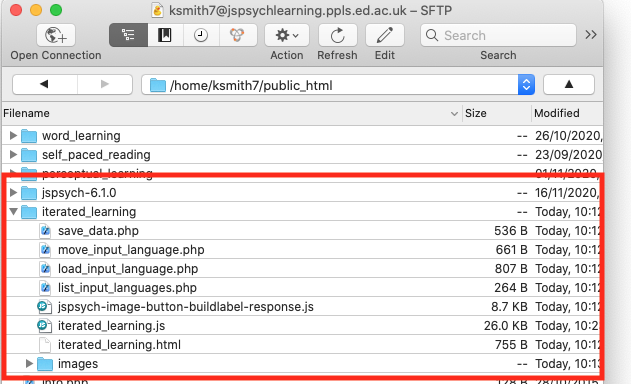
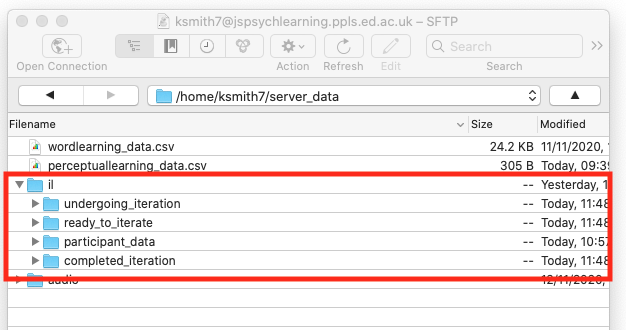

## The plan for week 10 practical

This week we are going to look at code for an iterated learning experiment, a simplified version of the experiment described in Beckner et al. (2017). There's no new material to look at in the Online Experiments with jsPsych tutorial.

In terms of the trial types we need to present to participants, this experiment is actually very simple, and uses elements of the code we developed in the practicals on word learning, perceptual learning and dyadic interaction.
- Participants go through an initial observation phase where they are exposed to two objects paired with short and long labels. Again, this is basically identical to the observation phase of the word learning experiment in `word_learning.js`.
- In the final test, where participants try to reproduce the language they are trained on, participants are presented with an object and asked to produce a label/description for it. Beckner et al. used a free-typing production method, where people type stuff in. In some recent work with online iterated learning we (my RA Clem Ashton and I) switched to a more constrained production model:
participants are provided with a set of syllable options, and build complex labels by clicking on those syllable buttons. This reduces or removes the problem of participants typing English (e.g. "don't know", "no idea")
or near-English versions of random labels (e.g. "vukano" -> "volcano"), which we were getting a lot of with free-typed responses on MTurk. Anyway, the upshot is that I have made a new plugin, `image-button-buildlabel-response` which is like the standard `image-button-response` plugin but allows you to click multiple buttons and build up a label. We use that in the production trials.

The complication this week is that rather than pre-specifying the language participants have to learn, we are running an *iterated learning* design: the language produced by one participant in the production phase becomes the input language to another participant in the observation phase, allowing us to pass the language from person to person and watch it evolve. Participants are organised in *chains*, where the participant at generation n in a particular chain learns from the language produced by the generation n-1 participant in that chain.

There are a number of ways you could do this for an online experiment. You could write a python server, a bit like the one we used for dyadic interaction, that keeps track of which chains are running, which participants are in which chains, and then passes over the appropriate training data when a new participant starts the experiment. Or you can run a database on the server (in another language, SQL, designed for managing databases), that does the same kind of thing, keeping track of which chains are open, which participants are in which chain, and so on.

But here we are going to go for a low-tech approach, using CSV files on the server to store the languages participants are producing, and then using PHP scripts (just like the ones we use for saving data) to write to those files, moves files around to different folders, and so on. This hopefully means that we can get an iterated learning experiment up and running without any extra fancy bells and whistles. In fact, in the confederate priming code we already looked at reading CSV files from the server to build a trial list, so some of the principles involved here are the same (e.g. using asynchronous functions to make javascript wait while PHP is off reading a file from the server). Again, like last week, I won't bother you with the contents of the PHP files too much, and instead talk you through the code at a conceptual level, focussing on the jsPsych end of things.  

Remember, as usual the idea is that you do as much of this as you can on your own (might be none of it, might be all of it) and then come to the practical drop-in sessions or use the chat on Teams to get help with stuff you need help with.

## Acknowledgments

The object stimuli for this week's experiment were provided by my colleague in Edinburgh Dr Jennifer Culbertson, who uses slightly different variants of these images in several of her excellent papers on order biases in noun phrase learning (e.g. [this paper in Cognition](https://doi.org/10.1016/j.cognition.2011.10.017)).

## An iterated learning experiment

### Getting started

*Important note:* This experiment requires a bit of careful set-up in your `server_data` folder on the jspsychlearning server, so don't just download it and start running it - read below for instructions on how to set everything up, otherwise the code will behave strangely and you'll be confused!

You need a bunch of files for this experiment - an html file, a couple of js files, some images, and a bunch of php files. Download the following zip file and then uncompress it into your usual jspsych folder:
- <a href="code/iterated_learning.zip" download> Download iterated_learning.zip</a>

This code won't work on your local computer, it needs to be on the jspsychlearning server - so once you have extracted the zip file, you need to upload the whole `iterated_learning` folder to your `public_html` folder on the jspsychlearning server, alongside your various other experiment folders and your `jspsych-6.1.0` folder. Here's what my `public_html` folder looks like on cyberduck.



You also need to tweak the `iterated_learning.js` code so it saves data to *your* `server_data` folder rather than mine. I have tried to make this more straightforward this week, so rather than messing with any of the PHP files, you can edit this in one place and it will work nicely everywhere. Open `iterated_learning.js` in an editor and find theline that says
```js
var myUUN = 'ksmith7'
```
In the version of the code I am looking at, that's around line 50. Then just swap my UUN (ksmith7) for yours - e.g. if your account name on the server is s1234567, change that line so it reads:
```js
var myUUN = 's1234567'
```

Finally, we need to set up some stuff in your `server_data` folder. Managing this iterated learning experiment means we need to keep track of several things. First, we want to record participant data trial-by-trial as it comes in, just like we also do. But we also need to keep track of which chains are available to iterate, which chains are currently being worked on by a participant, and which generations of which chains are completed and don't need to be messed with any more. We are going to manage that stuff by moving filers from folder to folder in `server_data`, so we need to set up those directories, and also drop in some starting languages to initialise our chains.

To do that, navigate into your `server_data` folder on cyberduck - you need to make sure that the folders you are creating inherit their access permissions etc from the main `server_data` folder, which you do by getting right into that folder on cyberduck before creating any new folders. So double-click the `server_data` folder so your navigation bar in cyberduck looks something like like this (but with your UUN rather than mine obviously)


Once you are there, create a new folder (Action ... New folder in cyberduck) and call that folder `il`. Then double-click to enter the `il` folder, and create *four* new folders in there, called `ready_to_iterate`, `undergoing_iteration`, `completed_iteration` and `participant_data`. Here's what my server_data folder looks like after that step - you can see the `il` directory with the 4 sub-directories. Note that you have to get the folder names exactly right, otherwise the code won't be able to find the stuff it needs.



We are going to use `participant_data` to save our trial-by-trial data like we usually do; the other 3 folders will be used to keep track of the state of each iterated learning chain.

Finally, we need to make some initial (generation 0) languages available. If you look in the `iterated_learning` directory you got from the zip file above, there's a sub-folder called `initial_languages_for_server_data`, containing two CSV files called `chain1_g0.csv` and `chain2_g0.csv`. Grab those and put them in the `ready_to_iterate` folder you just created in `server_data` - these are random languages that can server as the starting point for two iterated learning chains. Once you've done that, your `server_data` folder looks like this, and you are ready to go!


### Managing an iterated learning experiment via PHP scripts

In an iterated learning experiment, one participant's output becomes in the input for another participant. Participants are organised in chains, and you'll typically have several chains open at once (i.e. you need to add more participants to those chains to get them to the desired number of generations). There are three main kinds of events you have to handle:
1. When a new participant starts the experiment, you have to allocate them to an open chain (or deal with them some other way if there are no chains open), and avoid allocating any other new participants to the same chain until they are finished (i.e. there's no point in having two participants both competing to be generation 3 of chain 2 or whatever).
2. When a participant completes the experiment, you need to make their output language available as the input language for the next participant in their chain.
3. If a participant drops out (which happens *a lot* online) you need to recycle the chain that was allocated to them, making it available to another participant.

As I mentioned above, there are a bunch of ways you could do this, but here I've gone for a relatively simple solution. We will store input languages as CSV files on the jspsychlearning server - the files contain a list of object-label pairs which we can easily read in to create training for a participant, or write out based on what a participant does during production testing. The file name will give the chain number and generation number - so for instance, the file `chain1_g0.csv` is the language of generation 0 (i.e. the initial language) for chain 1, and the top of that file looks like this:
```
object,label
images/o1_cB_n1.png,visivu
images/o1_cB_n2.png,kotisu
images/o1_cB_n3.png,vovaso
images/o2_cB_n1.png,kukati
```
You can see that the object column is just the name of one of our stimulus images and the label column is a label for that object. Note that the image files have structured names too - the code doesn't care about that, but each image file specifies an object shape (o1, o2 or o3), a colour (cB, cG or c for blue, green and orange respectively), and a number (n1, n2 or n3, for 1, 2 or 3 objects in the image).

Reading from and writing to these CSV files provides a simple way to pass a language from participant to participant - we read in the language from a CSV file to create training data, then when the participant completes the production phase we can write a new language file capturing their language, which can be read in by the next participant in the chain. You should already be familiar with the idea that we can write to CSV files using PHP - that's what we have been doing every time we save a participant's trial data - and yu have also seen one example of reading in a CSV and creating a trial list (in the confederate priming practical).

We also need a way to keep track of which chains are open, which are in progress etc. We'll do this by moving files among the various directories you created in `server_data/il`.

Any files in the `ready_to_iterate` folder indicate chains that are ready to iterate - these can be used for a new participant who turns up looking to participate. Once we allocate a given generation of a given chain to a new participant (event 1 of the 3 events above), we move the input language CSV file to the `undergoing_iteration` folder - that stops it being allocated to anyone else while our participant is working on it.

If the participant completes the experiment (event 2 above) then we take their production output and write it as a new CSV file in `ready_to_iterate`, making it available for the next participant in the chain (and updating the generation number - e.g. if we train someone on the language in `chain1_g0.csv`, we write the language they produce to `chain1_g1.csv`). We also move their input language file out of `undergoing_iteration` and into `completed_iteration`. That's mainly to keep it nice and clear which generations of which chains are currently being worked on and which are complete - you can look at the various folders on `server_data/il/` and immediately see which chains are running, which are waiting for new participants, and which are done.

Finally, if our participant drops out (event 3 above), we just move the input language file they were working on back from `undergoing_iteration` to the `ready_to_iterate` folder - that makes it available again, and prevents drop-out participants clogging up our chains. Conveniently jsPsych provides a way of handling participant dropouts, allowing you to run a function to do stuff when the participant closes their browser window before completing the experiment.

All of these various actions are carried out by PHP scripts, which we can call from our jsPsych experiment. `list_input_languages.php` returns a list of files in the `ready_to_iterate` folder back to the jsPsych experiment, which we can use to figure out which chains are open and then pick a random chain for our new participant. `load_input_language.php` reads in a specific language file and sends it back to jsPsych in a usable format (note that this is slightly different from how we were reading in CSV files in the confederate priming code; now we are doing the reading in PHP, in the confederate priming code I was doing it in the javascript). We can use `save_data.php` to write participant's output languages (as well as saving participants' trial-by-trial data to the `participant_data` folder). And `move_input_language.php` handles the process of shuffling CSV files back and forth between our various directories.

### Digging in to the code: updating our save_data function

Now you (hopefully) get the general idea, we can have a look at some more detailed aspects of the code. The first thing to flag up is that I have changed the `save_data.php` script a bit, and also changed the `save_data` function in the javascript code, to make it a bit more general. In the old version of our `save_data.php` it was hard-wired to write to a specific sub-folder in *my* `server_data` folder, which was bad for two reasons: one, if you forgot to edit the PHP script to point to your `server_data` folder, all your data, weird voice recordings etc appear in my `server_data` folder and frighten/confuse me; two, for the new experiment we want to save stuff to two different sub-folders of `server-data/il` (saving participant data to `server-data/il/participant_data` and output languages to `server-data/il/ready_to_iterate`), and we really don't want to have to write two different PHP scripts which are trivially different from each other just to handle that.

The solution is to make the `save_data.php` and `save_data` javascript functions a bit more general - we pass in information about which user's server directory to use (ksmith7 for me, s... for you), and also which directory to save the data in (which avoids us having to create different PHP scripts for saving in slightly different directories). The new more general code looks like this:

```js

var myUUN = 'ksmith7'

function save_data(directory,filename,data){
  var url = 'save_data.php';
  var data_to_send = {user: myUUN, directory: directory, filename: filename, filedata: data};
  fetch(url, {
      method: 'POST',
      body: JSON.stringify(data_to_send),
      headers: new Headers({
              'Content-Type': 'application/json'
      })
  });
}
```

In particular, we now have to specify `myUUN` (to point the PHP script to the correct user's `server_data` directory) and pass more complex information over tot he PHP script (in `data_to_send`) - not just the filename and data, but also the user info and the directory to save in. The other stuff (the fetch command, the JSON stuff, etc) is the same as the old version and lower-level implementation stuff you don't have to worry about for now.

## Exercises with the iterated learning experiment code

In prep!

## References

[Beckner, C., Pierrehumbert, J., & Hay, J. (2017). The emergence of linguistic structure in an online iterated learning task. *Journal of Language Evolution, 2*, 160–176.](https://doi.org/10.1093/jole/lzx001)

## Re-use

All aspects of this work are licensed under a [Creative Commons Attribution 4.0 International License](http://creativecommons.org/licenses/by/4.0/).
