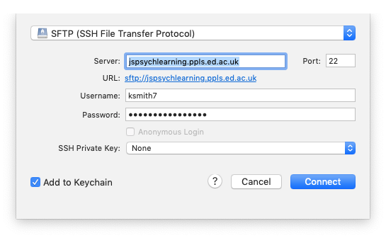

## The plan for week 2 practical

For the practical component of week 2 the plan is to learn enough of the basics of jsPsych so we can jump in to building simple experiments in week 3. Remember, the idea is that you do as much of this as you can on your own (which might be all of it or might be none of it!) and then come to the practical drop-in sessions or use the discussion board to get help with stuff you need help with.

## Practical tasks for this week

- Work through sections 00, 01, 02 and 03 of [Online Experiments with jsPsych tutorial](https://softdev.ppls.ed.ac.uk/online_experiments/index.html).
- Also look at the very first paragraph of [section 04](https://softdev.ppls.ed.ac.uk/online_experiments/jspsych.html), titled "Putting the code in its own file" - literally one paragraph, it just makes the code a bit neater so it helps if you read it now!

Once you have done these tasks you should be able to access the teaching server, upload code, edit code in something like Atom, and have a (very basic) idea of what a trivial jsPsych "hello world" experiment looks like. Next week we'll look at an actual experiment written in jsPsych.

Some things to note as you work through the practical.

- We will be playing with code on the teaching server, `jspsychlearning.ppls.ed.ac.uk`. As soon as I have the class registration list I will ask the techies to create an account for you on there. Until they set that up, you won't be able to access it, but you can still read through the tutorial. Also, you need to be on the University network to log in to the server (to upload files etc) - see instructions in the [Week 2 reading page](oels_reading_wk2.md) on how to access the VPN.
- In section 02, the tutorial recommends using CyberDuck for uploading files to the server - I agree, it's very nice. Just to emphasise, *you don't need to pay for it*, although it will ask you if you'd like to ocasionally. I have bought a license because I use it a lot, if that helps assuage your guilt.
- In section 03 the tutorial runs through some potential editors you can use to view/edit code. I am using Atom on a Mac, it's OK - if you want to use that you might have to download it from [the Atom website](https://atom.io).
- Note that in the jsPsych "hello world" tutorial, the name of the directory they give for the jspsych code might not match the name of the directory for you. In the tutorial it says that you load the various bits of jsPsych code with code like ``, but for me the downloaded jspsych code is actually in a directory called `jspsych-6` so I had to edit that script call to read ``, just so the browser is looking in the right place. If you try to run the hello world tutorial code and get a bunch of errors telling you that it can't find certain files, this might be the problem.

## Solutions to common problems

See below for some solutions to recurring problems. Remember, if you need help getting any of this stuff to work, remember that the practical drop-in sessions and the chat on Teams are available.

### I just get a blank screen

A classic problem is that you try to run your code and just get a blank screen. That means something has gone wrong, but what? The way to start to find out is to open the javascript console and see what it says. Often it will have a line in red saying that it can't find one or more files, you fix that (e.g. making sure the files are in the right place, see the answers above on directory structure and where to put everything) and that fixes it. Or it will mention a syntax error in one of the files, you fix that, and bingo.

Accessing the javascript console will be essential for finding bugs in your code - this might involve enabling developer tools for your browser, hopefully if you google "how to access javascript console in X" and "how to enable developer tools in X" where X is your browser, you'll find comprehensible instructions.

### Problem connecting to the jspsychlearning server

Check that:
1. You are on the VPN.
2. You are selecting SFTP in the cyberduck dropdown menu - i.e. for me it looks like the picture below. If you get the error "Connection failed. Connection timed out:connect. The connection attempt was rejected. The server may be down or your network may not be properly configured" this is probably the problem.

### Where do I put my Hello World code on the server?

For the hello world demo, you can just run the code on your own computer - but if you want to test it on the server, you need to copy your code into your public_html folder on jspsychlearning server. You want a folder called e.g. "hello" which contains experiment.html and the jspsych folder, e.g. something like this:

### How do I run the Hello World code once it's on the server?

Once you have put your code on the jspsychlearning server, some of you have been a bit puzzled about how to open it, and have tried e.g. clicking on the experiment.html file in cyberduck. All that will do is try to download the file back to your computer - cyberduck is for moving files about. The way to access your experiment once it's on the server is to open a web browser, e.g. chrome, and put something like http://jspsychlearning.ppls.ed.ac.uk/~UUN/hello/experiment.html in the address bar, where UUN is your student number (s20...). Note that this assumes your code is in your public_html folder, in a folder called hello - if you are using different directory names on the server, your url might be a little different. Also note the tilde (~) in front of your UUN.

## Re-use

All aspects of this work are licensed under a [Creative Commons Attribution 4.0 International License](http://creativecommons.org/licenses/by/4.0/).
