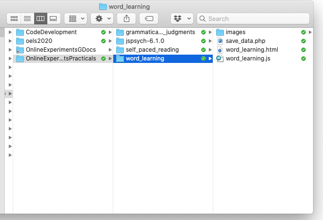

## The plan for week 6 practical

This week we are going to look at a bit more of the [Online Experiments with jsPsych tutorial](https://softdev.ppls.ed.ac.uk/online_experiments/index.html), and then look at code for a simple word learning / frequency learning experiment based on the Ferdinand et al. (2019) paper we read this week. This builds on the self-paced reading experiment in that it uses nested timelines and functions to construct trials which have a fairly complex structure. It also requires randomisation and contingent trials (what the participant sees on one trial depends on what they did at the previous trial), so we need to introduce some infrastructure to do that. Finally, I'll add some code to filter out the relevant trials and record that data on the server at the end of the experiment, rather than just dumping it to the screen.

Remember, as usual the idea is that you do as much of this as you can on your own (might be none of it, might be all of it) and then come to the practical drop-in sessions or use the chat on Teams to get help with stuff you need help with.

## Tutorial content

Read through [section 06 of the Online Experiments with jsPsych tutorial](https://softdev.ppls.ed.ac.uk/online_experiments/data.html). It's up to you whether you want to do the exercises dotted through the tutorial or not - they are not strictly necessary I think, since we will see the same bits of code in the word learning experiment, but you can if you want. The key things you need to take away from the tutorial are:
- You can save data to the server either at the end of the experiment, which is what I have implemented in the word learning code, or after every trial (which we will get to in a later week). Saving data line by line is better, since if a participant contacts you to tell you they got part-way through the experiment then their computer died you can actually verify this, pay them accordingly and also have some of their data. You don't have to understand the details of how the POST and php stuff works to save the data, just that it's possible and it works.
- The data property of jsPsych trials. Each trial has a `data` parameter which is populated by the code automatically depending on what the participant does during the trial - e.g. on an `html-button-response` trial it records the index of the button the participant pressed (0 for the first choice, 1 for the second choice), in the `button_pressed` property of the trial's data. But we can also add to the `data` parameter ourselves - we can add information on the participant to every trial (e.g. their ID number), or we can add specific bits of data to certain trials (in the tutorial Alisdair gives the example of marking up trial type to allow you to separate 'boring' trials from important ones). We'll use the data property for data filtering, but also to record important information like the label the participant clicked on (rather than just the index), which we can then use to build trials where the response at one trial affects what happens at the next trial.

## A word learning experiment

### Getting started

As per last week, I'd like you to download and run the code I provide, look at how the code works, and then attempt the exercises below, which involve editing the code in simple ways and puzzling over the output.

You need a bunch of files for this experiment - as usual an html file and a js file, but also a php file (for saving data) and a folder containing a bunch of images. Rather than downloading these seperately, download the following zip file and then uncompress it into your usual jspsych folder:
- <a href="code/word_learning.zip" download> Download word_learning.zip</a>

Again, the code makes some assumptions about the directory structure it's going to live in - regardless of whether you are putting this on your own computer or on the jspsychlearning server, these should sit in a folder called something like `word_learning`, alongside your `grammaticality_judgments`, `self_paced_reading` and `jspsych-6.1.0` folders.

Assuming you have the directory structure all right, this code should run on your local computer (just open the `word_learning.html` file in your browser) or you can upload the whole `word_learning` folder to the public_html folder on the jspsychlearning server and play with it there. Note that the code that saves the data to the server will only work if your code is actually running on the server - if you are running it on your own computer the data will not save anywhere, although it will still be shown on-screen.

First, get the code and run through it so you can check it runs, and you can see what it does. Then take a look at the HTML and js files in your code editor (e.g. Atom).

### Explanation of the code

I am writing this now!

## References

- [Ferdinand, V., Kirby, S., & Smith, K. (2019). The cognitive roots of regularization in language.
*Cognition, 184,* 53-68.](https://doi.org/10.1016/j.cognition.2018.12.002)

## Re-use

All aspects of this work are licensed under a [Creative Commons Attribution 4.0 International License](http://creativecommons.org/licenses/by/4.0/).
